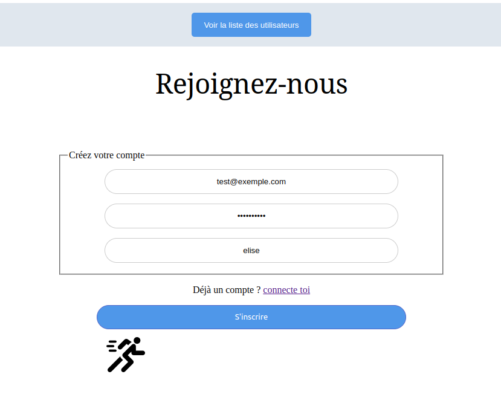
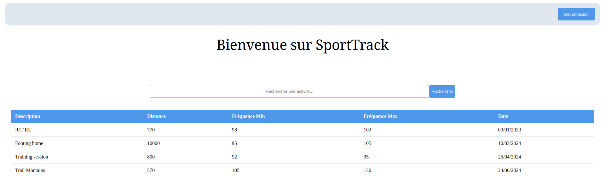
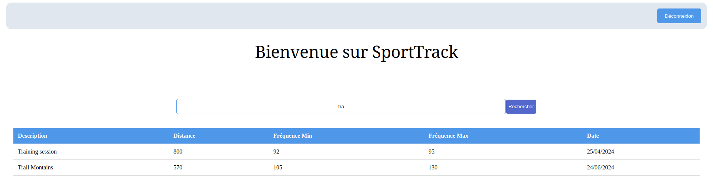
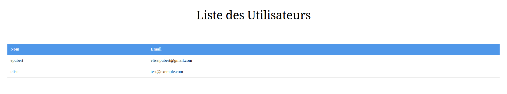

<!-- PROJECT LOGO -->
<br />
<div id="readme-top" align="center">
  <a href="">
    
  </a>

  <h3 align="center">SPORT TRACK</h3>

  <p align="center">
    PUBERT ELISE ● BUT2 GRA ● TP5
    <br />
    <br />
    <a href="https://moodle.univ-ubs.fr/mod/assign/view.php?id=362190">Dépot Moodle</a>
    ·
    <a href="https://people.irisa.fr/Nicolas.Le_Sommer/ens/R4.01/cours/">Cours</a>
    ·
    <a href="https://people.irisa.fr/Nicolas.Le_Sommer/ens/R4.01/tps/app_microservices/">Consignes</a>
  </p>
</div>


<!-- TABLE OF CONTENTS -->
<details>
  <summary>Table des matières</summary>
  <ol>
    <li>
      <a href="#about-the-project">About The Project</a>
      <ul>
        <li><a href="#built-with">Built With</a></li>
      </ul>
    </li>
    <li>
      <a href="#installation">Installation</a>
      <ul>
        <li><a href="#micro-services">Micro services</a></li>
        <li><a href="#front-end">Front-end</a></li>
      </ul>
    </li>
    <li>
      <a href="#features">Features</a>
      <ul>
        <li><a href="#user-service">User Service</a></li>
        <li><a href="#activity-service">Activity Service</a></li>
        <li><a href="#front-end">Front-end</a></li>
      </ul>
    </li>
    <li><a href="#usage">Usage</a></li>
    <li>
      <a href="#tests">Tests</a>
    </li>
  </ol>
</details>


<!-- ABOUT THE PROJECT -->
## About The Project

Ce TP utilise le framework java SpringBoot ainsi que le cadriciel Vue.js. L'objectif de ce TP est de mettre en place des micro service afin de gérer des utilisateurs et des activités.

Il permet de :
* Créer un compte utilisateur
* Se connecter en tant qu'utilisateur
* Voir la liste des activités réalisés (sans distinctions entre les utilisateurs)
* Voir la liste des utilisateurs crées


### Built With

Liste et documentations des frameworks et outils utilisés.

* [![Vue][Vue.js]][Vue-url]
* [![Spring][spring.io]][spring-url]
* [![JS][js]][js-url]
* [![HTML][html]][html-url]
* [![CSS][css]][css-url]


<!-- INSTALLATION -->
## Installation

_Instruction à suivre pour faire marcher le projet._

Executer chaques commandes à partir du repertoire courant dans un terminal différent pour chaque module.
### Micro services 
```sh
   cd sporttrack/sporttrack-activity-model/ && mvn clean install
   cd ../sporttrack-activity-service/ && mvn clean install spring-boot:run
```
```sh
   cd sporttrack/sporttrack-user-model/ && mvn clean install
   cd ../sporttrack-user-service/ && mvn clean install spring-boot:run
```

### Front-end
```sh
   cd sporttrack-frontend/ && npm install && npm run serve
```
Se rendre sur ``http://localhost:8080/``


<!-- FEATURES -->
## FEATURES

#### User Service
- **Port d'écoute** : 8082
- **Contrôleurs** :
  - **findAll** : Renvoie la liste de tous les utilisateurs.
    - **Requête** : `GET`
    - **Route** : `/users/`
  - **addUser** : Ajoute un nouvel utilisateur.
    - **Requête** : `POST`
    - **Route** : `/users/`
  - **searchUser** : Renvoie un utilisateur spécifique en fonction de l'email fourni.
    - **Requête** : `GET`
    - **Route** : `/users/login/{email}`

#### Activity Service
- **Port d'écoute** : 8081
- **Contrôleurs** :
  - **findAll** : Renvoie la liste de toutes les activités.
    - **Requête** : `GET`
    - **Route** : `/activities/`
  - **addActivity** : Ajoute une nouvelle activité.
    - **Requête** : `POST`
    - **Route** : `/activities/`
  - **findByKeyword** : Renvoie les activités correspondant à un mot-clé spécifié.
    - **Requête** : `GET`
    - **Route** : `/activities/{keyword}`

#### Frontend
- **Port d'écoute** : 8080
- **Vues** :
  - **Register** : Permet à un utilisateur de s'inscrire.
    - **Route** : `/register`
  - **Login** : Permet à un utilisateur de se connecter.
    - **Route** : `/login`
  - **ActivityList** : Affiche les activités.
    - **Route** : `/activities`
  - **UserList** : Affiche les utilisateurs
    - **Route** : `/users`


<br />
<p>
  <li>Lors de la connexion, le mot de passe sera hashé.</li>
  <li> De plus, la route /activities n'est disponible que si l'utilisateur est connecté. Tant qu'il n'a pas cliqué sur le bouton de déconnexion, il aura accès à la page.</li>
</p>
<br />

>*NBs : Lorsque les micros services sont lancés pour la première fois, ils récupèrent et dupliquent le fichier data.json / user.json du modèle. Ce fichier, est ensuite modifié dans le service.*


<!-- USAGE -->
## USAGE
#### exemple d'utilisation


<div align="center">
  <p>1. D'abord je m'inscris avec un mail valide non existant et un mot de passe respectant le pattern.</p>
  

  <p>2. Lorsque j'arrive sur mon compte j'accède à la liste des activités.</p>
  

  <p>3. Je peux les filtrer en recherchant un mot. "Tra" par exemple.</p>
  
  
  <p>4. Après m'être déconnectée j'accède depuis la page d'accueil à la liste des utilisateurs. On remarque alors que l'utilisateur a été rajouté entre temps.</p>
  
</div>


<!-- TESTS -->
## TESTS

*Cette section est dédiée aux tests des micros services.
Je vais d'abord effectuer des requetes sur le port 8081 (activités) puis sur le port 8082 (user)* 

### Activity Service Tests
1. récupération des activités

``` sh
$ curl -X GET "http://localhost:8081/activities/"
```
L'ensemble des activités est retournée

>[{"date":"03/01/2023","description":"IUT  RU","distance":770,"freqMin":98,"freqMax":103,"data":[{"time":"13:00:00","cardioFrequency":99,"latitude":47.644794,"longitude":-2.776605,"altitude":18.0},{"time":"13:00:05","cardioFrequency":100,"latitude":47.64687,"longitude":-2.778911,"altitude":18.0},{"time":"13:00:10","cardioFrequency":102,"latitude":47.6462,"longitude":-2.78022,"altitude":18.0}]},{"date":"10/03/2024","description":"Footing home","distance":10000,"freqMin":95,"freqMax":105,"data":[{"time":"09:24:00","cardioFrequency":110,"latitude":47.644794,"longitude":-2.776605,"altitude":5.0},{"time":"09:24:05","cardioFrequency":100,"latitude":47.64687,"longitude":-2.778911,"altitude":5.0},{"time":"09:24:10","cardioFrequency":102,"latitude":47.6462,"longitude":-2.78022,"altitude":5.0}]},{"date":"25/04/2024","description":"Training session","distance":800,"freqMin":92,"freqMax":95,"data":[{"time":"18:15:00","cardioFrequency":110,"latitude":47.644794,"longitude":-2.776605,"altitude":21.0},{"time":"18:15:05","cardioFrequency":100,"latitude":47.64687,"longitude":-2.778911,"altitude":21.0},{"time":"18:15:10","cardioFrequency":102,"latitude":47.6462,"longitude":-2.78022,"altitude":21.0}]},{"date":"24/06/2024","description":"Trail Montains","distance":570,"freqMin":105,"freqMax":130,"data":[{"time":"17:45:00","cardioFrequency":110,"latitude":47.644794,"longitude":-2.776605,"altitude":450.0},{"time":"17:45:05","cardioFrequency":100,"latitude":47.64687,"longitude":-2.778911,"altitude":445.0},{"time":"17:50:10","cardioFrequency":102,"latitude":47.6462,"longitude":-2.78022,"altitude":440.0}]}]

<br/>
<br/>
2. récupération des activités filtrées par mot-clé

``` sh
$ curl -X GET "http://localhost:8081/activities/RU"
```

>[{"date":"03/01/2023","description":"IUT  RU","distance":770,"freqMin":98,"freqMax":103,"data":[{"time":"13:00:00","cardioFrequency":99,"latitude":47.644794,"longitude":-2.776605,"altitude":18.0},{"time":"13:00:05","cardioFrequency":100,"latitude":47.64687,"longitude":-2.778911,"altitude":18.0},{"time":"13:00:10","cardioFrequency":102,"latitude":47.6462,"longitude":-2.78022,"altitude":18.0}]}]

``` sh 
$ curl -X GET "http://localhost:8081/activities/mo"
```

> [{"date":"24/06/2024","description":"Trail Montains","distance":570,"freqMin":105,"freqMax":130,"data":[{"time":"17:45:00","cardioFrequency":110,"latitude":47.644794,"longitude":-2.776605,"altitude":450.0},{"time":"17:45:05","cardioFrequency":100,"latitude":47.64687,"longitude":-2.778911,"altitude":445.0},{"time":"17:50:10","cardioFrequency":102,"latitude":47.6462,"longitude":-2.78022,"altitude":440.0}]}]

<br/>
<br/>
3. ajouter une activité

``` sh 
$ curl -X POST http://localhost:8081/activities/ -H "Content-Type: application/json" -H "Accept: application/json" -d '{
    "date":"06/05/2024",
    "description":"Vannes",
    "distance":5000,
    "freqMin":95,
    "freqMax":120, 
    "data":[
        {"time":"13:00:00",
        "cardioFrequency":99,
        "latitude":47.644794,
        "longitude":-2.776605,
        "altitude":18.0}
    ]
}'
```
>$ Activity added successfully

les lignes du json sont ensuite insérées dans le fichier data.json.

<br/>
<br/>
4. Ajouter une activité avec un fréquence invalide

``` sh
$ curl -X POST -H "Content-Type: application/json" -d '{"date":"06/05/2024","description":"Vannes","distance":5000,"freqMin":-95,"freqMax":120, "data":[{"time":"13:00:00","cardioFrequency":99,"latitude":47.644794,"longitude":-2.776605,"altitude":18.0}]}' http://localhost:8081/activities/
```

> $ La fréquence minimale doit être supérieure ou égale à zéro


<br/>
<br/>
5. Ajouter une activité sans le field data

``` sh
$ curl -X POST http://localhost:8081/activities/ -H "Content-Type: application/json" -H "Accept: application/json" -d '{
    "name": "Activity Name",
    "description": "Activity Description",
    "date": "2023-04-10",
    "duration": 60,
    "distance": 5.0,
    "freqMin": 120,
    "freqMax": 160
    }'
```
> $ must not be null


<br/>
<br/>
6. Ajouter une activité avec des champs @NotNull manquants

``` sh
$ curl -X POST http://localhost:8081/activities/ -H "Content-Type: application/json" -d '{
    "freqMax": 160,
    "data": [
            {
                "altitude": 18,
                "latitude": 47.644794,
                "cardio_frequency": 99,
                "time": "13:00:00",
                "longitude": -2.776605
            },
            {
                "altitude": 18,
                "latitude": 47.64687,
                "cardio_frequency": 100,
                "time": "13:00:05",
                "longitude": -2.778911
            },
            {
                "altitude": 18,
                "latitude": 47.6462,
                "cardio_frequency": 102,
                "time": "13:00:10",
                "longitude": -2.78022
            }
        ]
}'
```
>must not be null <br/>
 must not be null <br/>


### User Service Tests
1. récupération des utilisateurs

``` sh
$ curl -X GET "http://localhost:8082/users/"
```

L'ensemble des utilisateurs est retournée
>[{"name":"epubert","email":"elise.pubert@gmail.com","password":"abcdef1234!"},{"name":"elise","email":"test@exemple.com","password":"$2a$10$F0lsbuF2U9mc0XAlbDs2Je9WXCALyjlDsWaIqXjb59KkztR1NVHMS"},{"name":"Sophie","email":"test2@exemple.com","password":"$2a$10$8W7.ZRdnvIZxTNTP3Eib5ejAuaXX1Kt29FLPzqy/n1cG1HPQysioq"}]

<br/>
<br/>
2. récupération d'un utilisateur avec son e-mail

``` sh 
$ curl -X GET "http://localhost:8082/users/login?email=elise.pubert@gmail.com"
```

>{"exist":true,"user":{"name":"epubert","email":"elise.pubert@gmail.com","password":"abcdef1234!"}}

<br/>
<br/>
3. récupération d'un utilisateur qui n'existe pas

``` sh 
$ curl -X GET "http://localhost:8082/users/login?email=exemple@gmail.com"
```
>$ {"exist":false,"user":null}


<br/>
<br/>

4. Ajouter un utilisateur

``` sh 
$ curl -X POST http://localhost:8082/users/ -H "Content-Type: application/json" -d '{"password":"abcdef1234!", "name":"Jeanne","email":"test3@gmail.com"}'
```
>$ User added successfully 


<br/>
<br/>

5. Ajouter un utilisateur sans indiquer le mail

``` sh
$ curl -X POST http://localhost:8082/users/ -H "Content-Type: application/json" -d '{"password":"abcdef1234!", "name":"Jeanne"}'
```

> $ must not be null

6. Ajouter un utilisateur sans indiquer le mot de passe ni le nom
``` sh
curl -X POST http://localhost:8082/users/ -H "Content-Type: application/json" -d '{"email":"test3@gmail.com"}'
```
>must not be null <br/>
 must not be null <br/>


<p align="right">(<a href="#readme-top">back to top</a>)</p>


<!-- MARKDOWN LINKS & IMAGES -->
<!-- https://www.markdownguide.org/basic-syntax/#reference-style-links -->

[Vue.js]: https://img.shields.io/badge/Vue.js-35495E?style=for-the-badge&logo=vuedotjs&logoColor=4FC08D
[Vue-url]: https://vuejs.org/
[spring.io]: https://img.shields.io/badge/SpringBoot-6DB33F?style=flat-square&logo=Spring&logoColor=white
[spring-url]: https://spring.io/projects/spring-boot
[html]: https://img.shields.io/badge/HTML-239120?style=for-the-badge&logo=html5&logoColor=white
[html-url]: https://www.w3schools.com/html/default.asp
[css]: https://img.shields.io/badge/CSS-239120?&style=for-the-badge&logo=css3&logoColor=white
[css-url]: https://www.w3schools.com/css/default.asp
[js]: https://shields.io/badge/JavaScript-F7DF1E?logo=JavaScript&logoColor=000&style=flat-square
[js-url]: https://www.javascript.com/

